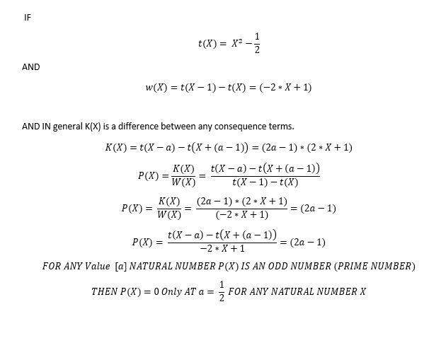
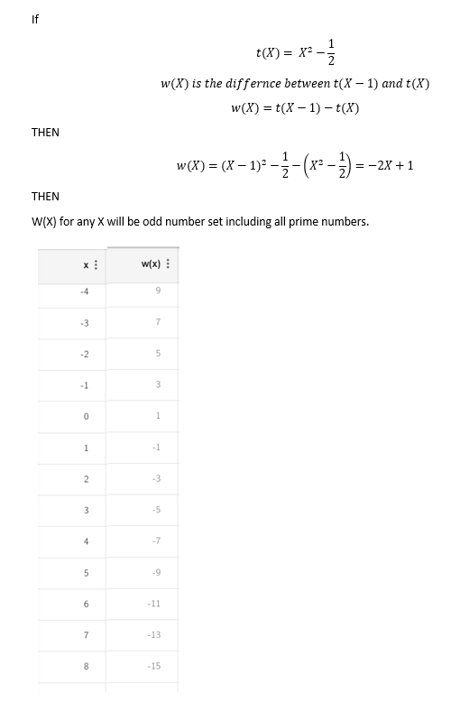
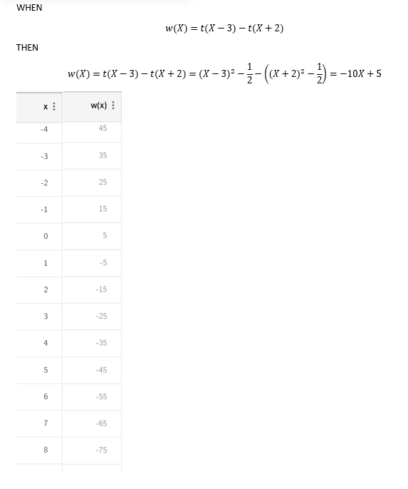
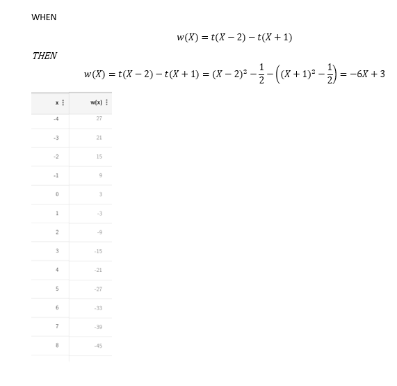
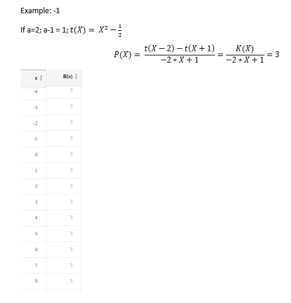
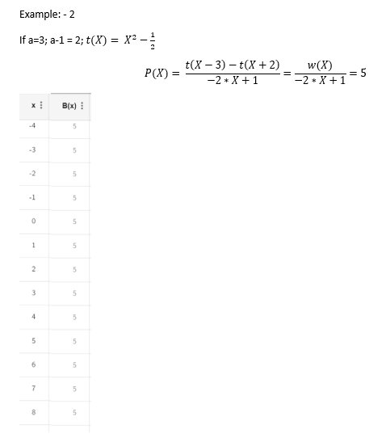
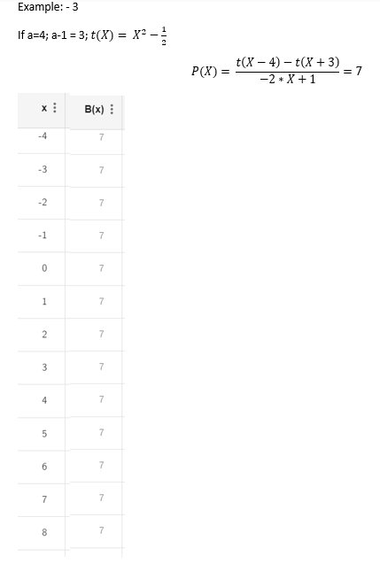

# X Square Minus Half

Generate any Natural Number from X Square Minus Half

<table><tr>
<td></td>
<td></td>
<td></td>
<td></td>
</tr>
<tr>
  <td></td>
  <td></td>
  <td></td>
</tr>
</table>

